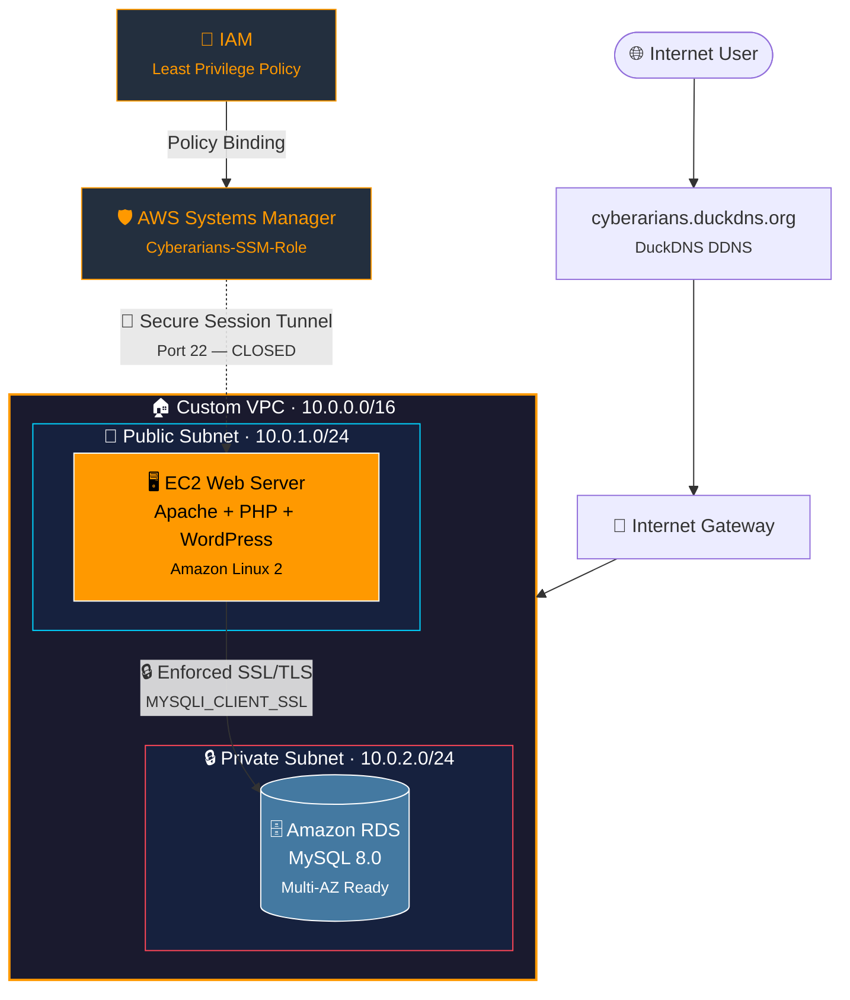

<div align="center">

<!-- AWS SVG Logo from SimpleIcons -->


<h1>🔐 Cyberarians Secure Cloud Infrastructure</h1>

<p><em>Production-grade AWS deployment featuring WordPress, RDS, SSM Zero-Trust Access & Custom Domain Mapping</em></p>

<br/>

<!-- Tech Badges -->
<p>
  
  
  
  
  
  
</p>

<!-- Status Badges -->
<p>
  
  
  
  
</p>

<br/>

> 🌐 **Live Deployment:** [http://cyberarians.duckdns.org](http://cyberarians.duckdns.org)  
> 👨‍💻 **Authors:** Hanzla & Saad — FAST NUCES (22F-3686 & 22F-3654)

</div>

---

## 📑 Table of Contents

- [Project Overview](#-project-overview)
- [Architecture Diagram](#-architecture-diagram)
- [Security Posture](#-security-posture)
- [AWS Services Used](#-aws-services-used)
- [Deployment Documentation](#-deployment-documentation)
- [Critical Troubleshooting Logs](#-critical-troubleshooting-logs)
- [Team](#-team)

---

## 🏛️ Project Overview

This project delivers a **production-ready, security-hardened cloud environment** built entirely on AWS. It demonstrates enterprise-grade infrastructure patterns including:

- **Zero-trust server access** via AWS Systems Manager — no SSH port ever opened
- **Encrypted database communication** with enforced SSL/TLS on the RDS layer
- **Network segmentation** through a custom VPC with public/private subnet isolation
- **Managed IAM governance** using least-privilege role binding

The stack runs a fully functional **WordPress CMS** served by Apache on EC2, backed by a **managed Amazon RDS MySQL** instance — accessible only over the public internet via a custom DuckDNS domain.

---

## 🏗️ Architecture Diagram



---

## 🔒 Security Posture

| Layer | Feature | Implementation |
|-------|---------|----------------|
| 🚪 **Access Control** | Zero-Trust Server Access | AWS Systems Manager (SSM) — Port 22 permanently closed |
| 🔐 **Data in Transit** | Encrypted DB Connections | `MYSQLI_CLIENT_SSL` enforced at application layer |
| 🌐 **Network Security** | Subnet Isolation | RDS resides in private subnet — unreachable from internet |
| 🛡️ **Security Groups** | Multi-Layer Firewalling | Only EC2 SG allows DB ingress on port 3306 |
| 👤 **IAM Governance** | Least-Privilege Role | `Cyberarians-SSM-Role` scoped to `AmazonSSMManagedInstanceCore` |
| 🔑 **Credential Management** | No Hardcoded Keys | All AWS access via IAM role, not access key pairs |

---

## ☁️ AWS Services Used

<table>
<tr>
  <td align="center"><br/><strong>EC2</strong><br/><sub>Web server host</sub></td>
  <td align="center"><br/><strong>VPC</strong><br/><sub>Network isolation</sub></td>
  <td align="center"><br/><strong>RDS MySQL</strong><br/><sub>Managed database</sub></td>
  <td align="center"><br/><strong>SSM</strong><br/><sub>Zero-trust access</sub></td>
  <td align="center"><br/><strong>IAM</strong><br/><sub>Role governance</sub></td>
</tr>
</table>

---

## 💻 Deployment Documentation

### 1. 🖥️ Environment Provisioning

Provision an **Amazon Linux 2** EC2 instance, attach the `Cyberarians-SSM-Role` IAM role, and connect via Systems Manager Session Manager.

```bash
# Update system & install full LAMP stack
sudo yum update -y
sudo yum install -y httpd wget php mariadb105 php-mysqlnd

# Start and enable Apache on boot
sudo systemctl start httpd
sudo systemctl enable httpd

# Verify SSM Agent is running (pre-installed on Amazon Linux 2)
sudo systemctl status amazon-ssm-agent
```

---

### 2. 📦 WordPress Core Installation

```bash
# Navigate to web root and download WordPress
cd /var/www/html
sudo wget https://wordpress.org/latest.tar.gz

# Extract and flatten directory structure
sudo tar -xzvf latest.tar.gz
sudo mv wordpress/* .
sudo rm -rf wordpress latest.tar.gz

# Set Apache as owner of all web files
sudo chown -R apache:apache /var/www/html
sudo chmod -R 755 /var/www/html
```

---

### 3. ⚙️ WordPress Configuration

```bash
# Create config from sample
sudo cp wp-config-sample.php wp-config.php
sudo nano wp-config.php
```

---

### 4. 🔐 Database Security Integration

> ⚠️ **Critical:** The RDS parameter group has `require_secure_transport = ON`. Connections without SSL are rejected with `ERROR 3159`. The fix is a single constant in `wp-config.php`.

```php
<?php
// Database credentials
define( 'DB_NAME',     'wordpress' );
define( 'DB_USER',     'admin' );
define( 'DB_PASSWORD', 'Your_Secure_Password_Here' );
define( 'DB_HOST',     'cyberarians-db.ce50igc46iwv.us-east-1.rds.amazonaws.com' );
define( 'DB_CHARSET',  'utf8mb4' );
define( 'DB_COLLATE',  '' );

/**
 * SECURITY: Force SSL transport for all RDS connections.
 * Resolves: "Connections using insecure transport are prohibited (ERROR 3159)"
 * Required because RDS parameter group enforces require_secure_transport=ON
 */
define( 'MYSQL_CLIENT_FLAGS', MYSQLI_CLIENT_SSL );
```

---

### 5. 🔗 Domain Mapping (DuckDNS)

```bash
# Install and configure DuckDNS auto-update cron job
echo "*/5 * * * * curl -s 'https://www.duckdns.org/update?domains=cyberarians&token=YOUR_TOKEN&ip=' > /dev/null" | crontab -

# Verify EC2 public IP reflects in DNS
nslookup cyberarians.duckdns.org
```

---

## 🛠️ Critical Troubleshooting Logs

### ❌ Issue 1: `ERROR 3159 — Connections using insecure transport are prohibited`

| | Details |
|---|---|
| **Root Cause** | RDS MySQL parameter group has `require_secure_transport = ON`, rejecting plain TCP connections |
| **Discovery** | Error surfaced during WordPress database connection test via `wp-admin` setup wizard |
| **Fix** | Added `define('MYSQL_CLIENT_FLAGS', MYSQLI_CLIENT_SSL)` to `wp-config.php`, forcing `mysqli` to negotiate TLS on connect |
| **Lesson** | RDS Secure Transport is a **per-parameter-group** setting — always check before provisioning WordPress |

---

### ❌ Issue 2: `SSM Agent Offline in Console`

| | Details |
|---|---|
| **Root Cause** | SSM Agent stale credential cache after IAM role reassignment to the instance |
| **Discovery** | Session Manager showed instance as "offline" despite EC2 being fully running |
| **Fix** | `sudo systemctl restart amazon-ssm-agent` — forces re-registration with SSM endpoints |
| **Lesson** | IAM role changes on a running instance require an agent restart to pick up new credentials |

---

### ❌ Issue 3: `403 Forbidden on WordPress Root`

| | Details |
|---|---|
| **Root Cause** | Apache serving files owned by `root`, not `apache` user |
| **Fix** | `sudo chown -R apache:apache /var/www/html` |

---

## 👨‍💻 Team

<div align="center">

| | Developer | Roll No | Contribution |
|---|---|---|---|
|  | **Hanzla** | 22F-3686 | Infrastructure, SSM Config, RDS Security |
|  | **Saad** | 22F-3654 | WordPress Setup, Networking, Domain Mapping |

</div>

---

<div align="center">


<br/>


</div>
