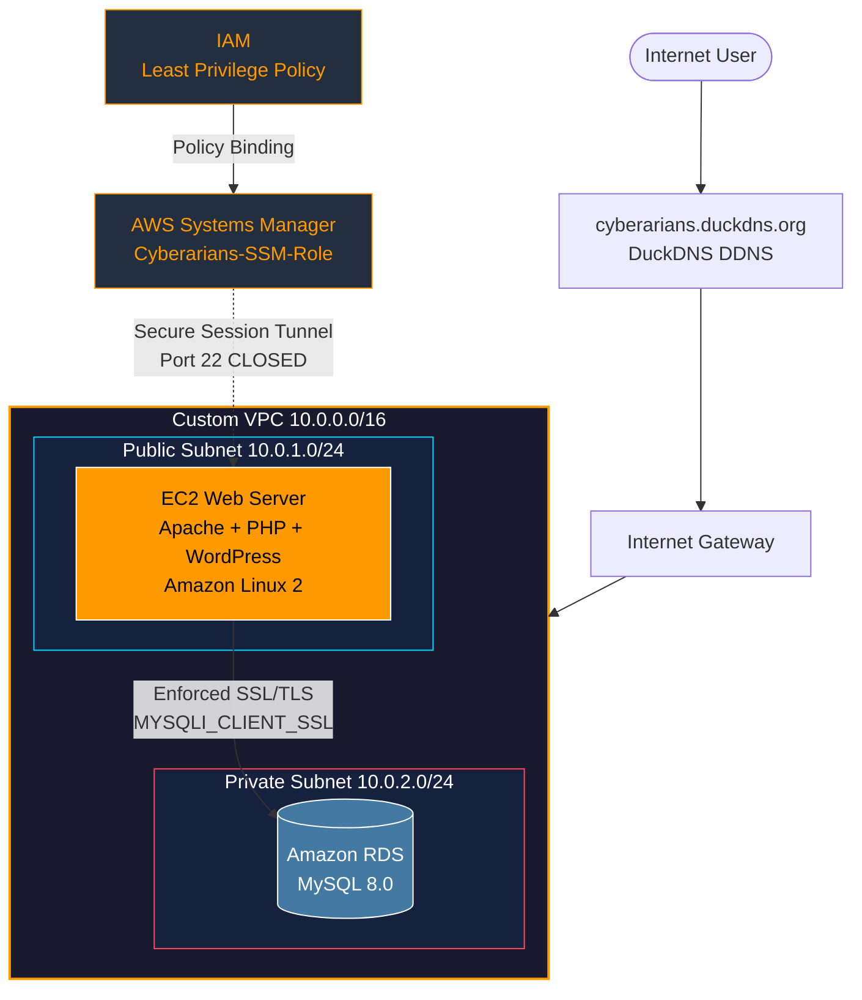

<div align="center">


<h1>Cyberarians Secure Cloud Infrastructure</h1>

<p>Production-grade AWS deployment — WordPress · RDS · SSM Zero-Trust Access · Custom Domain</p>

<br/>

<p>
  
  
  
  
  
  
</p>

<p>
  
  
  
  
</p>

<br/>

**Live URL:** [http://cyberarians.duckdns.org](http://cyberarians.duckdns.org) &nbsp;|&nbsp; **Team:** Hanzla (22F-3686) & Saad (22F-3654) — FAST NUCES

</div>

---

## Table of Contents

- [Project Overview](#project-overview)
- [Architecture](#architecture)
- [Security Posture](#security-posture)
- [AWS Services](#aws-services)
- [Deployment Guide](#deployment-guide)
- [Troubleshooting Log](#troubleshooting-log)
- [Team](#team)

---

## Project Overview

A **production-ready, security-hardened cloud environment** built entirely on AWS, demonstrating enterprise-grade infrastructure patterns:

- Zero-trust server access via **AWS Systems Manager** — SSH port permanently closed
- Encrypted database communication with **enforced SSL/TLS** at the RDS layer
- Network segmentation through a **custom VPC** with public/private subnet isolation
- Managed access governance via **least-privilege IAM role binding**

The stack runs a fully operational **WordPress CMS** served by Apache on EC2, backed by a **managed Amazon RDS MySQL** instance, exposed to the internet via a custom DuckDNS domain.

---

## Architecture



---

## Security Posture

| Layer | Feature | Implementation |
|-------|---------|----------------|
|  | Zero-Trust Server Access | AWS SSM Session Manager — Port 22 permanently closed |
|  | Encrypted DB Connections | `MYSQLI_CLIENT_SSL` enforced at application layer |
|  | Subnet Isolation | RDS in private subnet — unreachable from the public internet |
|  | Multi-Layer Security Groups | Only EC2 security group permitted to reach RDS on port 3306 |
|  | Least-Privilege Role | `Cyberarians-SSM-Role` scoped to `AmazonSSMManagedInstanceCore` only |
|  | No Hardcoded Keys | All AWS access via IAM instance profile — no access key pairs |

---

## AWS Services

<div align="center">

<table>
  <tr>
    <td align="center">
      <br/>
      <b>EC2</b><br/><sub>Web server host</sub>
    </td>
    <td align="center">
      <br/>
      <b>VPC</b><br/><sub>Network isolation</sub>
    </td>
    <td align="center">
      <br/>
      <b>RDS MySQL</b><br/><sub>Managed database</sub>
    </td>
    <td align="center">
      <br/>
      <b>SSM</b><br/><sub>Zero-trust access</sub>
    </td>
    <td align="center">
      <br/>
      <b>Apache</b><br/><sub>HTTP server</sub>
    </td>
    <td align="center">
      <br/>
      <b>PHP</b><br/><sub>Runtime</sub>
    </td>
  </tr>
</table>

</div>

---

## Deployment Guide

### 1. Environment Provisioning

Provision an **Amazon Linux 2** EC2 instance, attach the `Cyberarians-SSM-Role` IAM role before launch, then connect via **Systems Manager > Session Manager** — no key pair required.

```bash
# Update system and install full LAMP stack
sudo yum update -y
sudo yum install -y httpd wget php mariadb105 php-mysqlnd

# Start Apache and enable on boot
sudo systemctl start httpd
sudo systemctl enable httpd

# Confirm SSM Agent is running (pre-installed on Amazon Linux 2)
sudo systemctl status amazon-ssm-agent
```

---

### 2. WordPress Core Installation

```bash
# Download and extract WordPress into web root
cd /var/www/html
sudo wget https://wordpress.org/latest.tar.gz
sudo tar -xzvf latest.tar.gz
sudo mv wordpress/* .
sudo rm -rf wordpress latest.tar.gz

# Transfer ownership to Apache process user
sudo chown -R apache:apache /var/www/html
sudo chmod -R 755 /var/www/html
```

---

### 3. Database Security Integration

> **Critical:** The RDS parameter group has `require_secure_transport = ON`. Any plain TCP connection is rejected with `ERROR 3159`. The fix is one constant in `wp-config.php`.

```bash
sudo cp wp-config-sample.php wp-config.php
sudo nano wp-config.php
```

```php
define( 'DB_NAME',     'wordpress' );
define( 'DB_USER',     'admin' );
define( 'DB_PASSWORD', 'Your_Secure_Password_Here' );
define( 'DB_HOST',     'cyberarians-db.ce50igc46iwv.us-east-1.rds.amazonaws.com' );
define( 'DB_CHARSET',  'utf8mb4' );

/**
 * Force SSL transport for all RDS connections.
 * Fixes: "Connections using insecure transport are prohibited (ERROR 3159)"
 * Required: RDS parameter group enforces require_secure_transport = ON
 */
define( 'MYSQL_CLIENT_FLAGS', MYSQLI_CLIENT_SSL );
```

---

### 4. Domain Mapping via DuckDNS

```bash
# Auto-update DuckDNS with EC2 public IP every 5 minutes
echo "*/5 * * * * curl -s 'https://www.duckdns.org/update?domains=cyberarians&token=YOUR_TOKEN&ip=' > /dev/null" | crontab -

# Verify DNS resolution
nslookup cyberarians.duckdns.org
```

---

## Troubleshooting Log

### Issue 1 — `ERROR 3159: Connections using insecure transport are prohibited`

| Field | Detail |
|-------|--------|
| **Root Cause** | RDS parameter group has `require_secure_transport = ON`, silently dropping non-SSL connections |
| **Discovery** | Error surfaced during WordPress database setup via the `wp-admin` install wizard |
| **Resolution** | Added `define('MYSQL_CLIENT_FLAGS', MYSQLI_CLIENT_SSL)` to `wp-config.php` |
| **Lesson** | RDS Secure Transport is a per-parameter-group setting — audit it before any application provisioning |

---

### Issue 2 — SSM Agent Offline in Console

| Field | Detail |
|-------|--------|
| **Root Cause** | Stale credential cache in SSM Agent after IAM role was reassigned to the instance |
| **Discovery** | Session Manager showed instance as "offline" despite EC2 running normally |
| **Resolution** | `sudo systemctl restart amazon-ssm-agent` |
| **Lesson** | IAM role changes on a live instance require an agent restart to pick up new credentials |

---

### Issue 3 — `403 Forbidden` on WordPress Root

| Field | Detail |
|-------|--------|
| **Root Cause** | Web files owned by `root`, not the `apache` process user |
| **Resolution** | `sudo chown -R apache:apache /var/www/html` |

---

## Team

<div align="center">

<table>
  <tr>
    <th>Developer</th>
    <th>Roll Number</th>
    <th>Contributions</th>
  </tr>
  <tr>
    <td><a href="https://github.com/Hanzlase"></a></td>
    <td>22F-3686</td>
    <td>Infrastructure provisioning, SSM configuration, RDS SSL security</td>
  </tr>
  <tr>
    <td></td>
    <td>22F-3654</td>
    <td>WordPress setup, VPC networking, domain mapping</td>
  </tr>
</table>

<br/>


</div>
